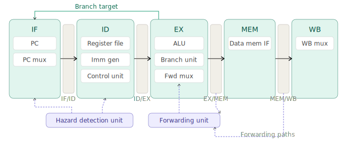

# RISC-V RV32I 5-Stage Pipelined Processor

A fully synthesizable 32-bit RISC-V processor implementing the RV32I base integer
instruction set, with a 5-stage pipeline and UVM-based verification environment.

## Architecture Overview

### Pipeline Stages
1. **IF** - Instruction Fetch
2. **ID** - Instruction Decode & Register Read
3. **EX** - Execute / ALU Operation
4. **MEM** - Memory Access
5. **WB** - Write Back

### Features
- [ ] RV32I base integer instruction set (37 instructions)
- [ ] 5-stage pipeline with forwarding unit
- [ ] Data hazard detection and stalling
- [ ] Branch prediction (static not-taken)
- [ ] Instruction and Data memory interfaces
- [ ] Full UVM verification environment
- [ ] Synthesis targeting Xilinx Artix-7

### Supported Instructions

**R-Type:** ADD, SUB, AND, OR, XOR, SLL, SRL, SRA, SLT, SLTU
**I-Type:** ADDI, ANDI, ORI, XORI, SLTI, SLTIU, SLLI, SRLI, SRAI, LW, LB, LH, LBU, LHU, JALR
**S-Type:** SW, SB, SH
**B-Type:** BEQ, BNE, BLT, BGE, BLTU, BGEU
**U-Type:** LUI, AUIPC
**J-Type:** JAL

## Verification Strategy

- Directed tests for each instruction type
- Constrained random instruction sequences
- UVM scoreboard with reference model comparison
- Functional coverage: instruction type, hazard scenarios, branch outcomes
- Code coverage: statement, branch, toggle, FSM

## Tools

- **Simulation:** Cadence Xcelium / Synopsys VCS
- **Synthesis:** Synopsys Design Compiler / Xilinx Vivado
- **Verification:** UVM 1.2, SystemVerilog

## Status

🔨 **In Progress** - Currently in specification and architecture phase

## Author

**Rakshith Srinivas** - M.Eng EEE, University of Galway
