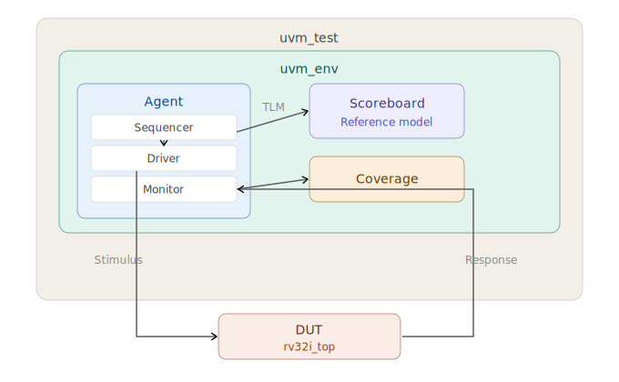

# Verification Plan: RISC-V RV32I Pipelined Processor

## 1. Verification Goals

- 100% instruction correctness against the RISC-V ISA specification (RV32I v2.1)
- Functional coverage ≥ 95% on all defined covergroups
- Code coverage ≥ 90% (statement, branch, toggle)
- All pipeline hazard scenarios exercised

## 2. Verification Architecture

## 3. Feature Coverage Matrix

| # | Feature | Test Type | Coverage Goal | Status |
|---|---------|-----------|---------------|--------|
| 1 | R-type arithmetic (ADD, SUB) | Directed + Random | All opcodes hit | ⬜ Not started |
| 2 | R-type logic (AND, OR, XOR) | Directed + Random | All opcodes hit | ⬜ Not started |
| 3 | R-type shift (SLL, SRL, SRA) | Directed + Random | Shift amounts 0-31 | ⬜ Not started |
| 4 | R-type compare (SLT, SLTU) | Directed | Signed/unsigned corners | ⬜ Not started |
| 5 | I-type arithmetic | Directed + Random | All opcodes, imm range | ⬜ Not started |
| 6 | I-type loads (LW, LH, LB, LHU, LBU) | Directed | All widths, alignment | ⬜ Not started |
| 7 | S-type stores (SW, SH, SB) | Directed | All widths, alignment | ⬜ Not started |
| 8 | B-type branches (all 6) | Directed + Random | Taken/not-taken each | ⬜ Not started |
| 9 | U-type (LUI, AUIPC) | Directed | Upper immediate values | ⬜ Not started |
| 10 | J-type (JAL, JALR) | Directed | Jump targets, link reg | ⬜ Not started |
| 11 | RAW hazard — forwarding EX→EX | Directed | All forwarding paths | ⬜ Not started |
| 12 | RAW hazard — forwarding MEM→EX | Directed | All forwarding paths | ⬜ Not started |
| 13 | Load-use hazard (stall) | Directed | Stall + forward combo | ⬜ Not started |
| 14 | Control hazard (branch flush) | Directed | Taken branch flushes | ⬜ Not started |
| 15 | Back-to-back branches | Random | Branch after branch | ⬜ Not started |
| 16 | x0 hardwired to zero | Directed | Write to x0 ignored | ⬜ Not started |
| 17 | Reset behavior | Directed | All regs cleared | ⬜ Not started |
| 18 | Random instruction stream | Constrained random | Overall coverage | ⬜ Not started |

## 4. Covergroups

### 4.1 Instruction Type Coverage
- Bins for each of the 37 instructions
- Cross coverage: instruction type × source register (x0 vs non-x0)

### 4.2 Hazard Scenario Coverage
- Bins: no hazard, EX-EX forward, MEM-EX forward, load-use stall
- Cross: hazard type × instruction type

### 4.3 Branch Coverage
- Bins: taken vs not-taken for each of the 6 branch types
- Cross: branch direction × previous instruction type

### 4.4 ALU Operand Corner Cases
- Bins: zero, max positive, max negative, all-ones
- Cross: operand A corners × operand B corners × ALU operation

## 5. Scoreboard Strategy

The scoreboard contains a software reference model of the RV32I ISA.
For each instruction driven to the DUT:
1. The reference model executes the same instruction
2. The monitor captures the DUT's register write-back and memory writes
3. The scoreboard compares DUT output to reference model output
4. Any mismatch is flagged as `UVM_ERROR`

## 6. Regression Plan

| Suite | Contents | Run Frequency |
|-------|----------|---------------|
| Smoke | 1 directed test per instruction type | Every commit |
| Nightly | All directed + 10 random seeds | Daily |
| Full | All directed + 100 random seeds + corner cases | Weekly |

## 7. Tools

- Simulator: Cadence Xcelium / Synopsys VCS
- Coverage: built-in simulator coverage tools
- Waveform: Cadence SimVision / Synopsys DVE / Verdi
